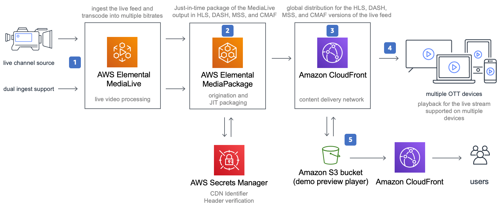

# Live Streaming on AWS

How to implement Live streaming on AWS  at scale leveraging AWS Elemental MediaLive,  MediaPackage and Amazon CloudFront. This repo contains the source code for the AWS solution [Live Streaming on AWS](https://aws.amazon.com/solutions/implementations/live-streaming-on-aws/?did=sl_card&trk=sl_card).

## Architecture Overview



**AWS Elemental MediaLive**<br/>
Is configured to ingest 2 live feeds and transcode the content into multiple adaptive bitrate HLS content.  The solution can be configured to ingest RTP RTMP HLS and MediaConnect streams and will apply 1 of 3 encoding profiles which include bitrates of 1080p through 270p. The encoding profile is set at launch and is based on the source resolution (See Encoding Profiles below).

**AWS Elemental MediaPackage**<br/>
Ingests the MediaLive Output and package the Live stream into HLS, DASH, and CMAF formats that are delivered through 3 MediaPackage custom endpoints.

**Amazon CloudFront**<br/>
Is configured with the MediaPackage custom endpoints as the Origins for the distribution. CloudFront then enable the live stream content to be delivered globally and at scale.

**Optional Demo Deployment**<br/>
As part of the CloudFormation template a Demo HTML preview player is deployed to an Amazon S3 bucket which is a single page HTML/JavaScript application that will playback the HLS, DASH, MSS and CMAF streams. In addition, the solution can be configured to ingest a Demo HLS feed hosted on AWS.   


## Deployment
The solution is deployed using a CloudFormation template with a lambda backed custom resource, available in both NodeJS and Python.
For details on deploying the solution please see the details on the Solution home page:  [Live Streaming on AWS](https://aws.amazon.com/solutions/implementations/live-streaming-on-aws/?did=sl_card&trk=sl_card)

## Encoding Profiles
To solution Configures AWS Elemental MediaLive with one of three encoding profiles based on the source resolution defined at launch as a CloudFormation parameter. The three options are 1080, 720, 540 and correspond to the following encoding profiles:

* HD-1080p profile: 1920x1080, 1280x720, 960x540, 768x432, 640x360, 512x288
* HD-720p profile: 1280x720, 960x540, 768x432, 640x360, 512x288
* SD-540p profile:  960x540, 768x432, 640x360, 512x288

The profiles are defined in JSON and and can be found in:
```
  source/custom-resource/lib/medialive/encoding-profiles/
```

## Source code

**source/custom-resources::**<br/>
A NodeJS based  Lambda function used as a custom resource for deploying MediaLive and MediaPackage resources through CloudFormation.

## Deployment
The solution can be deployed through the CloudFormation template available on the solution [home page](https://aws.amazon.com/solutions/implementations/live-streaming-on-aws/).

## Creating a custom build

### Prerequisites:
* [AWS Command Line Interface](https://aws.amazon.com/cli/)
* Node.js 12.x or later
* AWS CDK 1.125.0

The are 2 options for deploying the solution: using the CDK deployment tools or running the build script to generate a CFN template and the packaged lambda code.

### Options 1: Deploying through the CDK.
This options simply flollows the standard CDK deployment process. You will need to run `cdk bootstrap` before you run cdk deploy the first time to setup the cdk resource in your AWS account. Details on using the CDK can be found [here].

1. Download or clone the repo and make the required changes to the source code.
2. installl the dependencies for the lambda function and construct.
3. then run `cdk deploy` (first time use you will need to run `cdk bootstrap` first)

```
cd ./source/custom-resource
npm install --production
cd ../constructs
npm install 
cdk bootstrap //if you havent already done so.
cdk deploy
```

### Option 2: Generate a CloudFormation template.
The CloudFormation template (generated by the CDK) includes a lambda backed custom resource to configure MediaLive and create a UUID. To launch the solution the Lambda source code has to be deployed to an Amazon S3 bucket in the region you intend to deploy the solution. 

### 1. Clone the repo
Download or clone the repo and make the required changes to the source code.

### 2. Running unit tests for customization
Run unit tests to make sure added customization passes the tests:
```
cd ./deployment
chmod +x ./run-unit-tests.sh && ./run-unit-tests.sh
```

### 3. Create an Amazon S3 Bucket
The CloudFormation template is configured to pull the Lambda deployment packages from Amazon S3 bucket in the region the template is being launched in. Create a bucket in the desired region with the region name appended to the name of the bucket. eg: for us-east-1 create a bucket named: `my-bucket-us-east-1`
```
aws s3 mb s3://my-bucket-us-east-1
```

Ensure that you are owner of the AWS S3 bucket. 
```
aws s3api head-bucket --bucket my-bucket-us-east-1 --expected-bucket-owner YOUR-AWS-ACCOUNT-NUMBER
```

### 4. Create the deployment packages
Build the distributable:
```
chmod +x ./build-s3-dist.sh
./build-s3-dist.sh <my-bucket> live-streaming-on-aws <version>
```

> **Notes**: The _build-s3-dist_ script expects the bucket name as one of its parameters. This value should not have the region suffix (remove the -us-east-1)

Deploy the distributable to the Amazon S3 bucket in your account:
```
aws s3 sync ./regional-s3-assets/ s3://my-bucket-us-east-1/live-streaming-on-aws/<version>/ 
aws s3 sync ./global-s3-assets/ s3://my-bucket-us-east-1/live-streaming-on-aws/<version>/ 
```

### 5. Launch the CloudFormation template.
* Get the link of the live-streaming-on-aws.template uploaded to your Amazon S3 bucket.
* Deploy the solution.

## License

* This project is licensed under the terms of the Apache 2.0 license. See here `LICENSE`.

This solution collects anonymous operational metrics to help AWS improve the
quality of features of the solution. For more information, including how to disable
this capability, please see the [implementation guide](https://docs.aws.amazon.com/solutions/latest/live-streaming/welcome.html).